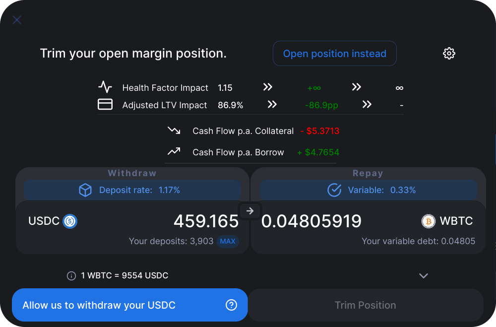

# How to use 1delta's margin aggregator

Our margin aggregator smart contract is used in a similar manner as the Uniswap Router.

## Supplying initial collateral / Withdraw / Borrow / Repay

Initially we have to select a trade type by clicking "Start Trading" and then picking the position that we want to interact with. 

The following screenshot shows a selection of WETH on the collateral side, meaning that the we want to interact with a WETH collateral position.

 
*Selecting a single asset on the collateral side allows us to either withdraw or deposit to the lender.*

Clicking on the large blue button now allows us to connect a swap trade either with a deposit or withdrawal transaction. 
We have to depoist collateral before we can commence with any other transaction type.

 
*On the left hand side, a direct supply is initiated, on the right hand side, a swap from USDC to WETH is done before supplying the obtained WETH*

Withdrawals can be done by clicking on "Withdraw instead" or on the arrow between the input panels.

If we want to borrow or repay funds,we have to select a single currency on the debt side. 

## Trade on margin

With having collateral, we now can directly open a margin position by picking one currency on the collateral side and one on the debt side. 
The following shows a selection of a user that wants to build a long WETH position that is funded by borrowing USDC. Pressing on the trade button again will allow us to exectue the trade.

 
*On the left hand side, a direct supply is initiated, on the right hand side, a swap from USDC to WETH is done before supplying the obtained WETH*

The swap modal now shows us an indication of how a trade looks like. We an either provide the amount of WETH that we want to deposit or the amount of USDC that we want to borrow. Either way, we have to approve borrow delegation first, i.e. allow the 1delta router to borrow funds on our behalf. We also can select between the different borrowing modes when trading on top of AAVE.

 
*The swap modal also shows the impact of the trade on our health factor and LTV.*

After the execution of the trade, we can now see our positions:

 
*The swap modal also shows the impact of the trade on our health factor and LTV.*

## Swap Debt

With 1delta, we can also exchange our debt positions in a single click. If we want to swap our USDC debt to another currency, we can just pick USDC and the target currency (in this case WBTC) to open a debt swap trade configuration.

 
*Open the debt swap configuratuion by selecting two debt currencies.*

In the trade configuration, we have to approve borrow delegation (if we haven't done so yet) to be able to borrow WBTC. When picking the maximum amount, the 1delta smart contracts make sure that there will be no dust left in the position to be repaid. If the positions are in the incorrect order, we can just click on the arrow between the input panel to switch them.

 
*The swap modal also shows the impact of the trade on our health factor and LTV.*

Post-trade we can see that our initial USDC debt position vanished entirely and has been replaced by a WBTC debt position.

 
*After a debt swap for which the maximum repay amount has been selected, no dust will remain.*

## Swap Collateral

Trading your collateral without being required to withdraw and repay debt is a big feature of 1delta. By selecting 2 colalteral positions, we can simply swap them. In our example, we want to exchange our WETH collateral to USDC collateral.

 
*After a debt swap for which the maximum repay amount has been selected, no dust will remain.*

If we press the trade button, we open the configuration. Selecting all our WETH to swap will convert our entire WETH colalteral position to a USDC collateral position:

 
*After a debt swap for which the maximum repay amount has been selected, no dust will remain.*

After approving the withdrawal and execution, we see that our entire collateral position was exchanged:

 
*After a debt swap for which the maximum repay amount has been selected, no dust will remain.*

## Close margin position

In case our health factor drops rapidly, we can prevent liquidation in a single click, too. 1delta allows us to directly withdraw, swap and repay a loan in one click. 
In this cas, similar to opening a margin position, we have to select one currency on the collateral side, the currency we want to withdraw and one currency on the debt side, the currency that we want to repay.

If we then click on the trade button, we have to either click on the arrow or click on the button saying "Close position instead" to be able to reduce our position. We will be required to approve that the 1delta contract can withdraw the collateral on our behalf as the following screenshot illustrates.

 
*After a debt swap for which the maximum repay amount has been selected, no dust will remain.*

After the execution of our trade we see that there is no debt position left.

 
*After a debt swap for which the maximum repay amount has been selected, no dust will remain.*

This allows us then to withdraw all our collateral as described in the first step.